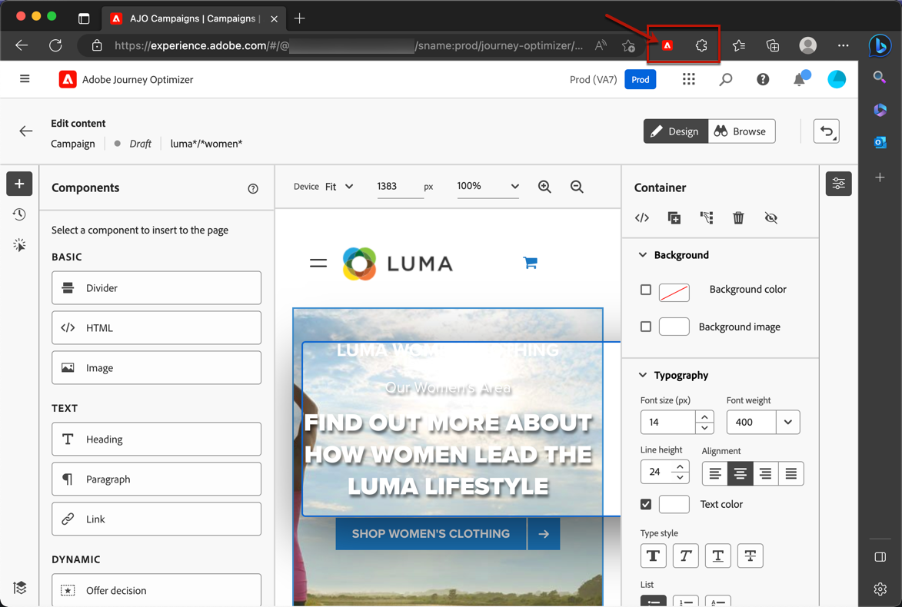
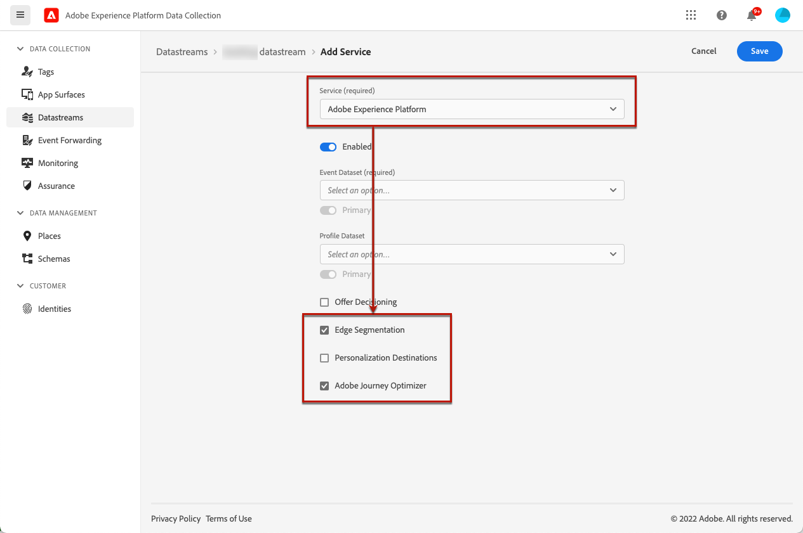
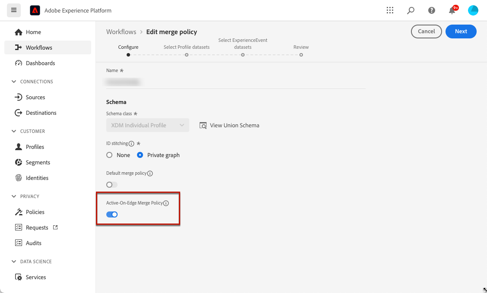

# Prerequisites and guardrails {#web-prerequisites}

To be able to access and author web pages in the [!DNL Journey Optimizer] user interface, follow the prerequisites below:

* To add modifications to your website, you need to have a specific implementation. [Learn more](#implementation-prerequisites)

* To access the [!DNL Journey Optimizer] web designer, you must have a specific Google Chrome browser extension installed. [Learn more](#visual-authoring-prerequesites)

* For the web experience to be delivered correctly, make sure you define the Adobe Experience Platform settings detailed [here](#delivery-prerequisites).

## Caution notes {#caution-notes-web}

* Currently in [!DNL Journey Optimizer] you can only create web experiences in **campaigns**. [Learn more](../campaigns/create-campaign.md#configure)

* [!DNL Journey Optimizer] web campaigns target new profiles that have not been engaged before on other channels. This will increase your total engageable profile count, which may have cost implications if the contractual number of engageable profiles you purchased is exceeded. Licence metrics for each package are listed on the [Journey Optimizer Product Description](https://helpx.adobe.com/legal/product-descriptions/adobe-journey-optimizer.html) page.

>[!AVAILABILITY]
>
>For now, Web channel is not available for organizations that have purchased the Adobe Healthcare Shield add-on offering.
>

## Implementation prerequisites {#implementation-prerequisites}

Currently two types of implementations are supported to enable authoring and delivery of web channel campaigns on your web properties:

* Client-side only – To add modifications to your website, you need to implement the [Adobe Experience Platform Web SDK](https://experienceleague.adobe.com/docs/platform-learn/implement-web-sdk/overview.html){target="_blank"} on your website.

    >[!NOTE]
    >
    >Make sure your AEP Web SDK version is 2.16 or above.

* Hybrid mode – You can use the [AEP Edge Network Server API](https://experienceleague.adobe.com/docs/experience-platform/edge-network-server-api/data-collection/interactive-data-collection.html){target="_blank"} to request for personalization server-side; the response is provided to the Adobe Experience Platform Web SDK to render the modifications client-side. Learn more in the Adobe Experience Platform [Edge Network Server API documentation](https://experienceleague.adobe.com/docs/experience-platform/edge-network-server-api/overview.html){target="_blank"}. You can find out more about the hybrid mode and check some implementation samples in [this blog post](https://blog.developer.adobe.com/hybrid-personalization-in-the-adobe-experience-platform-web-sdk-6a1bb674bf41){target="_blank"}.

>[!NOTE]
>
>The server-side only implementation is not currently supported.

<!--If the Adobe Experience Platform Web SDK is not yet implemented on the website, a message displays in the web designer suggesting that you install the Visual Editing Helper browser extension and implement the [Web SDK](https://experienceleague.adobe.com/docs/platform-learn/implement-web-sdk/overview.html){target="_blank"}.-->

## Visual authoring prerequisites {#visual-authoring-prerequisites}

<!--In order to rapidly author and preview your web experiences, the Adobe Experience Cloud Visual Editing Helper browser extension for Google Chrome lets you load websites reliably within the Adobe [!DNL Journey Optimizer] web designer.-->

To be able to open, author and preview your web pages reliably into the [!DNL Journey Optimizer] web designer, you must have the [Adobe Experience Cloud Visual Editing Helper](https://chrome.google.com/webstore/detail/adobe-experience-cloud-vi/kgmjjkfjacffaebgpkpcllakjifppnca){target="_blank"} browser extension installed on your web browser.

>[!CAUTION]
>
>Google Chrome and Microsoft Edge are currently the only browsers that support authoring web pages in [!DNL Journey Optimizer].

### Install the Visual Editing Helper extension {#install-visual-editing-helper}

To download and install the Visual Editing Helper browser extension, follow the steps below.

1. Open a new tab in your browser (Google Chrome or Microsoft Edge).

1. Go to the [Google Chrome Web Store](https://chrome.google.com/webstore/category/extensions){target="_blank"}.

1. If you are using Microsoft Edge, select **[!UICONTROL Allow extensions from other stores]** on the top banner. This will allow you to add extensions from the Chrome Web Store to Microsoft Edge.

1. Search and navigate to the [Adobe Experience Cloud Visual Editing Helper](https://chrome.google.com/webstore/detail/adobe-experience-cloud-vi/kgmjjkfjacffaebgpkpcllakjifppnca){target="_blank"} browser extension.

1. Click **[!UICONTROL Add to Chrome]** > **[!UICONTROL Add Extension]**.

    >[!NOTE]
    >
    >If you are using Microsoft Edge, this will add the extension to Edge even though the button is labelled **[!UICONTROL Add to Chrome]**.

1. Make sure the Visual Editing Helper browser extension is correctly enabled in your browser's toolbar.

    

<!--1. Launch [!DNL Journey Optimizer] in a new tab of your browser with the extension installed.

1. Create a web channel campaign in [!DNL Journey Optimizer]. [Learn how](author-web.md#create-web-campaign)

1. Open the [!DNL Journey Optimizer] web designer to start authoring your web experience. [Learn more](author-web.md)-->

The Adobe Experience Cloud Visual Editing Helper is now automatically enabled when a website is opened in the [!DNL Journey Optimizer] web designer to power authoring.

The extension does not have any conditional settings and handles all the settings automatically, including SameSite cookies settings.

>[!NOTE]
>
>Some websites might not open reliably in the [!DNL Journey Optimizer] web designer due to one of the following reasons:
>
> * The website has strict security policies.
> * The website is in an iframe.
> * The customer's QA or stage site is not available to the outside world (the site is internal).

### Troubleshoot website not loading {#troubleshooting}

When using the Adobe [!DNL Journey Optimizer] web designer, if you attempt to load a website that fails to load, a message displays suggesting that you install the [Visual Editing Helper browser extension](#install-visual-editing-helper).

If the Visual Editing Helper browser extension is correctly installed, but the website still fails to load or behaves unexpectedly, a potential fix is to open your website in the browser and accept cookies before trying to load it in the [!DNL Journey Optimizer] web designer.

For pages under authentication, if the login page fails to load, or if after trying to log in you are still not logged in:

* Try to log in first in a new browser tab and navigate to the desired page, then copy the URL and try to open it in the [!DNL Journey Optimizer] web designer.

* If you still cannot load your website in the [!DNL Journey Optimizer] web designer, contact Adobe Customer Care to report the problem, making sure you specify the failing URL.

## Delivery prerequisites {#delivery-prerequisites}

For the web experience to be delivered correctly, the following settings must be defined:

* In the [Adobe Experience Platform Data Collection](https://experienceleague.adobe.com/docs/experience-platform/edge/datastreams/overview.html){target="_blank"}, make sure you have a datastream defined such as under the **[!UICONTROL Adobe Experience Platform]** service you have the **[!UICONTROL Adobe Journey Optimizer]** option enabled.

    This ensures that the Journey Optimizer inbound events are correctly handled by the Adobe Experience Platform Edge. [Learn more](https://experienceleague.adobe.com/docs/experience-platform/edge/datastreams/configure.html){target="_blank"}

    

* In [Adobe Experience Platform](https://experienceleague.adobe.com/docs/experience-platform/profile/home.html){target="_blank"}, make sure you have one merge policy with the **[!UICONTROL Active-On-Edge Merge Policy]** option enabled. To do this, select a policy under the **[!UICONTROL Customer]** > **[!UICONTROL Profiles]** > **[!UICONTROL Merge Policies]** Experience Platform menu. [Learn more](https://experienceleague.adobe.com/docs/experience-platform/profile/merge-policies/ui-guide.html#configure){target="_blank"}

    This merge policy is used by [!DNL Journey Optimizer] inbound channels to correctly activate and publish inbound campaigns on the edge. [Learn more](https://experienceleague.adobe.com/docs/experience-platform/profile/merge-policies/ui-guide.html){target="_blank"}

    

## Content experiment prerequisites {#experiment-prerequisites}

To enable content experiments for the web channel, you need to make sure the [dataset](../data/get-started-datasets.md) used in your web implementation [datastream](https://experienceleague.adobe.com/docs/experience-platform/datastreams/overview.html){target="_blank"} is also included in your reporting configuration.

In other words, when configuring experiment reporting, if you add a dataset that is not present in your web datastream, web data will not display in the content experiment reports.

Learn how to add datasets for content experiment reporting in [this section](../campaigns/reporting-configuration.md#add-datasets).

>[!NOTE]
>
>The dataset is used read-only by the [!DNL Journey Optimizer] reporting system and doesn't affect data collection or data ingestion.

If you are **not** using the following pre-defined [field groups](https://experienceleague.adobe.com/docs/experience-platform/xdm/tutorials/create-schema-ui.html#field-group){target="_blank"} for your dataset schema: `AEP Web SDK ExperienceEvent` and `Consumer Experience Event` (as defined in [this page](https://experienceleague.adobe.com/docs/platform-learn/implement-web-sdk/initial-configuration/configure-schemas.html#add-field-groups){target="_blank"}), make sure to add the following field groups: `Experience Event - Proposition Interactions`, `Application Details`, `Commerce Details`, and `Web Details`. These are needed by the [!DNL Journey Optimizer] content experiment reporting as they are tracking which experiments and treatments each profile is participating in.

>[!NOTE]
>
>Adding these field groups doesn't impact the normal data collection. It is additive only for the pages where an experiment is running, leaving all the other tracking untouched.

## Branded domains for assets {#branded-domains-for-assets}

When authoring web experiences, if you add content coming from the [Adobe Experience Manager Assets Essentials](../content-management/assets-essentials.md) library, you  must set up the subdomain that will be used to publish this content. [Learn more](web-delegated-subdomains.md)
