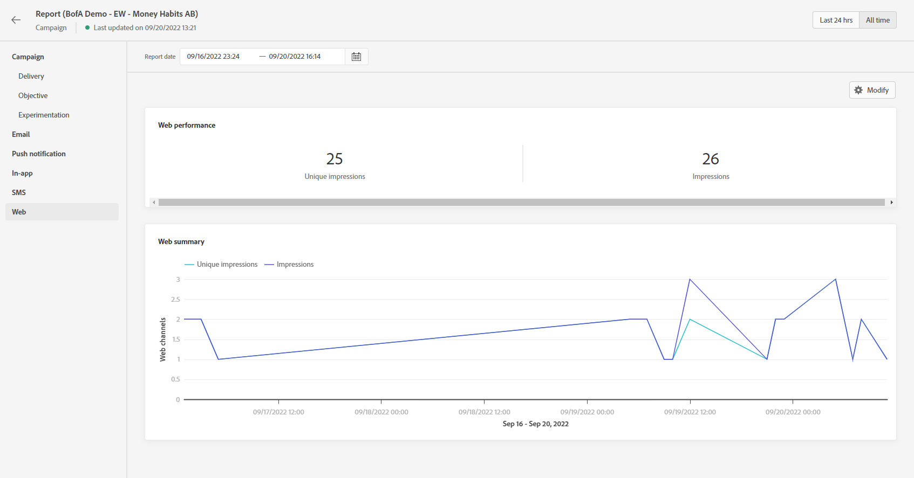

# Web report {#web-report}

The Web report is available in the Campaign report.

The Campaign report page will be displayed with the following tabs:

* [Campaign](../reports/campaign-global-report.md#campaign-live)
* [Web](#web-tab)

The Campaign **[!UICONTROL Global report]** is divided into different widgets detailing your campaign's success and errors. Each widget can be resized and deleted if needed. For more information on this, refer to this [section](../reports/global-report.md#modify-dashboard).

For a detailed list of every metric available in Adobe Journey Optimizer, refer to [this page](../reports/global-report.md#list-of-components-global.md)

## Web tab {#web-tab}

The **[!UICONTROL Web performance]** KPIs detail the main information relative to your visitors' engagement with your web experiences, such as:

* **[!UICONTROL Unique impressions]**: number of unique users to whom the web experience was delivered.

* **[!UICONTROL Impressions]**: total number of web experiences delivered to all users.

* **[!UICONTROL Click rate]**: percentage of visitors who interacted with the various elements on your web pages.

The **[!UICONTROL Web summary]** graph shows the evolution of your web experiences (impressions, unique impressions and clicks) for the concerned period.

The **[!UICONTROL Clicks by element]** table details the main information relative to your visitors' engagement with the various elements on your web pages.

