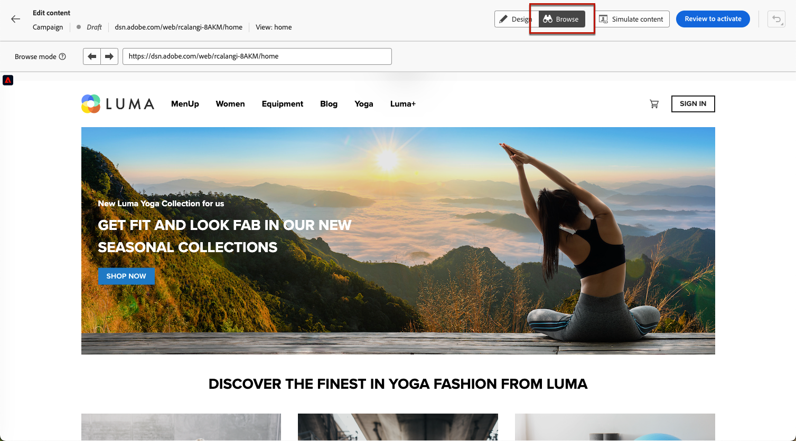
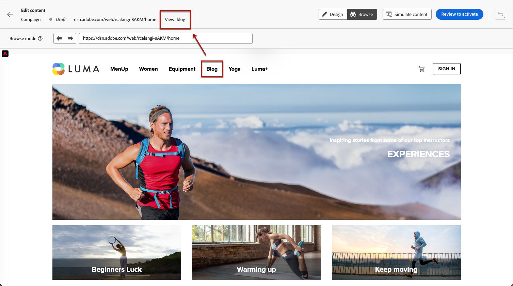
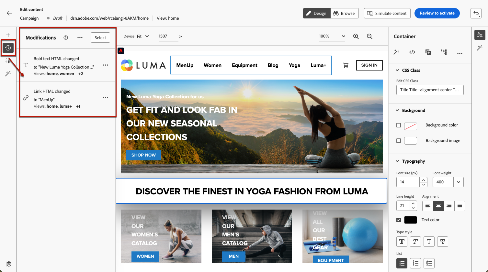
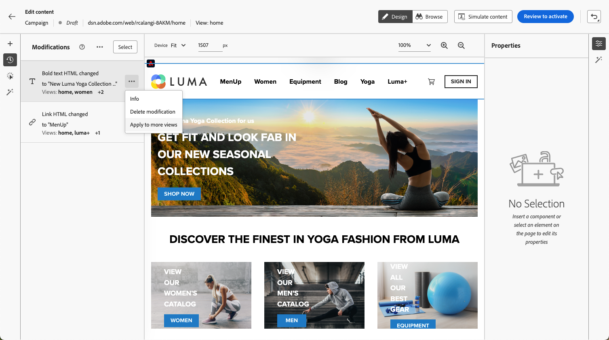
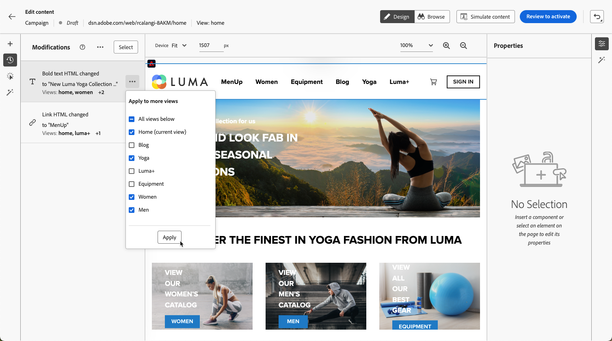
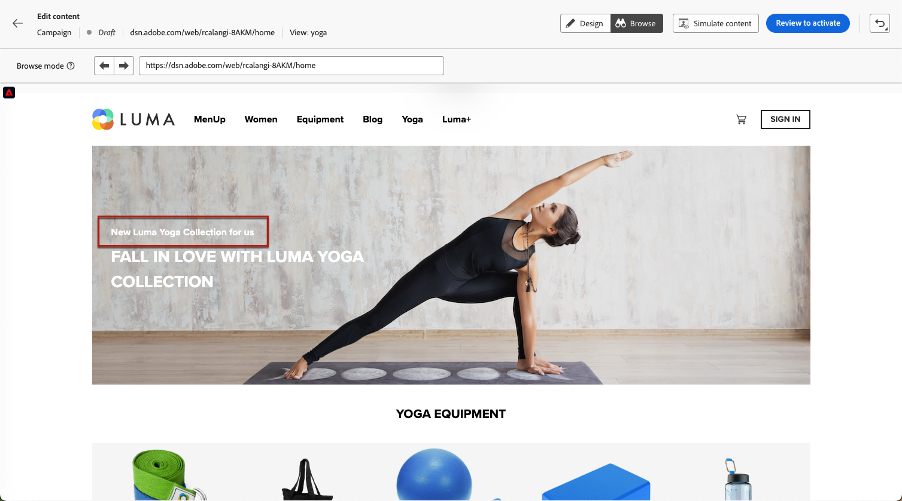

# Author single-page applications {#web-author-spas}

## About views {#about-views}

>[!CONTEXTUALHELP]
>id="ajo_web_designer_modifications_views"
>title="Apply changes to selected views"
>abstract="The changes will be applied only for selected views. Views can be discovered using the **Browse** mode and navigate to them. Can't find the view you are looking for?"
>additional-url="https://experienceleague.adobe.com/docs/platform-learn/implement-web-sdk/overview.html" text="Learn more"

**Single-page applications** (SPAs) can now be authored in the web designer visual editor. This allows you to select which specific views you want to apply your web page modifications to.

A view can be defined as a whole site or a group of visual elements on a site, such as the home page, the entirety of the products site or the delivery preferences frame on all the checkout pages.

One-time developer setup is needed to define the views in the Adobe Experience Platform Web SDK implementation. This enables you to create and run Adobe Journey Optimizer web campaigns on SPAs.

## Define views in the Web SDK implementation {#define-views}

XDM views can be leveraged in Adobe [!DNL Journey Optimizer] to empower marketers to run web personalization and experimentation campaigns on SPAs via the web visual editor. [Learn more](web-spa-implementation.md)

To be able to access and author views in the [!DNL Journey Optimizer] user interface, make sure you follow the steps listed in [this section](web-spa-implementation.md#implement-xdm-views).

## Discover views in the web designer {#discover-views}

Once SPAs setup is done in the Adobe Experience Platform Web SDK implementation, you need to navigate through all the views of your website that you want to apply modifications to. Follow the steps below.

1. [Create a web campaign](create-web.md) and access the [web designer](edit-web-content.md).

    The view you are currently in is displayed on top left.

    

1. Swap to **[!UICONTROL Browse]** mode. [Learn more](../web/edit-web-content.md#browse-mode)

    

1. Navigate between the different pages of the website to discover them all. The view name displayed on top changes when you go through another page.

    

## Apply modifications to other views {#apply-modifications-views}

Once you adeed a modification while being in a specific view, you can apply it to other selected views. Follow the steps below.

>[!CAUTION]
>
>If you have not discovered views using the **[!UICONTROL Browse]** mode, you will not be able to select them for applying your modifications. [Learn more](#discover-views)

1. Select the **[!UICONTROL Modifications]** icon to display the corresponding pane on the left.

    

1. Select any modification and click the **[!UICONTROL More actions]** button next to it. Select **[!UICONTROL Apply to more views]**.

    

1. Select the views you want to apply your changes to.

    

1. Click **[!UICONTROL Apply]**.

1. Swap to **[!UICONTROL Browse]** mode to check the modifications are applied on the desired pages.

    
